# Sơ đồ DFD Mức 2 - Quản lý bán hàng điện thoại online

## Tổng quan

Sơ đồ DFD (Data Flow Diagram) mức 2 chi tiết hóa các process chính từ mức 1 thành các subprocess nhỏ hơn, cho thấy luồng dữ liệu và xử lý chi tiết trong hệ thống.

## DFD Level 2 - Chi tiết các Process

```plantuml
@startuml DFD Level 2
title Data Flow Diagram Level 2 - Quản lý bán hàng điện thoại online

' External Entities
actor "Khách hàng (Customer)" as Customer
actor "Quản trị viên (Admin)" as Admin

' Level 1 Processes (giữ lại để tham khảo)
rectangle "1.0 Quản lý người dùng" as P1 #lightblue
rectangle "2.0 Quản lý sản phẩm" as P2 #lightgreen
rectangle "3.0 Xử lý đơn hàng" as P3 #lightyellow
rectangle "4.0 Quản lý tồn kho" as P4 #lightcoral

' Level 2 Processes cho 1.0
rectangle "1.1 Đăng ký tài khoản" as P1_1
rectangle "1.2 Đăng nhập" as P1_2
rectangle "1.3 Lấy thông tin profile" as P1_3
rectangle "1.4 Cập nhật profile" as P1_4

' Level 2 Processes cho 2.0
rectangle "2.1 Xem danh sách sản phẩm" as P2_1
rectangle "2.2 Tìm kiếm sản phẩm" as P2_2
rectangle "2.3 Lọc sản phẩm" as P2_3
rectangle "2.4 Xem chi tiết sản phẩm" as P2_4
rectangle "2.5 Thêm sản phẩm" as P2_5
rectangle "2.6 Sửa sản phẩm" as P2_6
rectangle "2.7 Xóa sản phẩm" as P2_7

' Level 2 Processes cho 3.0
rectangle "3.1 Quản lý giỏ hàng" as P3_1
rectangle "3.2 Tạo đơn hàng" as P3_2
rectangle "3.3 Xử lý thanh toán" as P3_3
rectangle "3.4 Cập nhật trạng thái" as P3_4
rectangle "3.5 Xem lịch sử đơn hàng" as P3_5
rectangle "3.6 In hóa đơn" as P3_6

' Level 2 Processes cho 4.0
rectangle "4.1 Xem tồn kho" as P4_1
rectangle "4.2 Cập nhật tồn kho" as P4_2
rectangle "4.3 Khởi tạo tồn kho" as P4_3
rectangle "4.4 Giảm tồn kho" as P4_4
rectangle "4.5 Tăng tồn kho" as P4_5

' Databases
database "D1: Users" as D1
database "D2: Products" as D2
database "D3: Orders" as D3
database "D4: Order_Items" as D4
database "D5: Inventory" as D5

' Data Flows cho 1.0 Quản lý người dùng
Customer --> P1_1 : Thông tin đăng ký\n(username, password, email, fullname)
P1_1 --> D1 : Lưu thông tin user mới
P1_1 --> Customer : Xác nhận đăng ký thành công

Customer --> P1_2 : Thông tin đăng nhập\n(username, password)
P1_2 --> D1 : Xác thực thông tin
P1_2 --> Customer : JWT token + thông tin user

Customer --> P1_3 : userId
P1_3 --> D1 : Truy vấn profile
P1_3 --> Customer : Thông tin profile

Customer --> P1_4 : userId + thông tin cập nhật
P1_4 --> D1 : Cập nhật profile
P1_4 --> Customer : Xác nhận cập nhật

' Data Flows cho 2.0 Quản lý sản phẩm
Customer --> P2_1 : Yêu cầu xem sản phẩm
P2_1 --> D2 : Truy vấn danh sách
P2_1 --> Customer : Danh sách sản phẩm

Customer --> P2_2 : Từ khóa tìm kiếm
P2_2 --> D2 : Tìm kiếm theo tên/hãng
P2_2 --> Customer : Kết quả tìm kiếm

Customer --> P2_3 : Tiêu chí lọc\n(hãng, giá, sao)
P2_3 --> D2 : Lọc sản phẩm
P2_3 --> Customer : Danh sách đã lọc

Customer --> P2_4 : masp
P2_4 --> D2 : Lấy chi tiết sản phẩm
P2_4 --> Customer : Thông tin chi tiết SP

Admin --> P2_5 : Thông tin SP mới
P2_5 --> D2 : Thêm sản phẩm
P2_5 --> Admin : Xác nhận thêm SP

Admin --> P2_6 : masp + thông tin cập nhật
P2_6 --> D2 : Cập nhật sản phẩm
P2_6 --> Admin : Xác nhận cập nhật

Admin --> P2_7 : masp
P2_7 --> D2 : Xóa sản phẩm
P2_7 --> Admin : Xác nhận xóa

' Data Flows cho 3.0 Xử lý đơn hàng
Customer --> P3_1 : Thao tác giỏ hàng\n(thêm/sửa/xóa)
P3_1 --> D3 : Lưu/thay đổi giỏ hàng
P3_1 --> Customer : Giỏ hàng cập nhật

Customer --> P3_2 : Thông tin đơn hàng\n(items, totalAmount)
P3_2 --> D3 : Tạo order mới
P3_2 --> D4 : Lưu chi tiết items
P3_2 --> Customer : orderId + xác nhận

P3_2 --> P3_3 : Thông tin thanh toán
P3_3 --> Customer : Xác nhận thanh toán

Admin --> P3_4 : orderId + trạng thái mới
P3_4 --> D3 : Cập nhật status
P3_4 --> Admin : Xác nhận cập nhật

Customer --> P3_5 : userId
P3_5 --> D3 : Truy vấn orders
P3_5 --> D4 : Lấy order items
P3_5 --> Customer : Lịch sử mua hàng

Customer --> P3_6 : orderId
P3_6 --> D3 : Lấy thông tin order
P3_6 --> D4 : Lấy order items
P3_6 --> Customer : Hóa đơn PDF

' Data Flows cho 4.0 Quản lý tồn kho
Admin --> P4_1 : Yêu cầu xem tồn kho
P4_1 --> D5 : Truy vấn inventory
P4_1 --> Admin : Danh sách tồn kho

Admin --> P4_2 : masp + stock mới
P4_2 --> D5 : Cập nhật stock
P4_2 --> Admin : Xác nhận cập nhật

Admin --> P4_3 : Yêu cầu khởi tạo
P4_3 --> D5 : Khởi tạo stock mặc định
P4_3 --> Admin : Xác nhận khởi tạo

P3_4 --> P4_4 : Duyệt đơn hàng
P4_4 --> D5 : Giảm stock theo quantity
P4_4 --> P3_4 : Xác nhận giảm stock

P3_4 --> P4_5 : Hủy đơn hàng
P4_5 --> D5 : Tăng stock theo quantity
P4_5 --> P3_4 : Xác nhận tăng stock

@enduml
```

## Chi tiết các Process Level 2

### 1.0 Quản lý người dùng

**1.1 Đăng ký tài khoản**

- Input: username, password, email, fullname, phone, address
- Process: Validate dữ liệu, kiểm tra trùng lặp, hash password
- Output: userId, xác nhận thành công
- Database: INSERT vào Users table

**1.2 Đăng nhập**

- Input: username, password
- Process: Verify credentials, generate JWT token
- Output: JWT token, user info (id, username, fullname, role)
- Database: SELECT từ Users table

**1.3 Lấy thông tin profile**

- Input: userId
- Process: Truy vấn thông tin user
- Output: fullname, email, phone, address, role
- Database: SELECT từ Users table

**1.4 Cập nhật profile**

- Input: userId, fields to update (email, fullname, phone, address, password)
- Process: Validate input, update fields
- Output: Xác nhận cập nhật thành công
- Database: UPDATE Users table

### 2.0 Quản lý sản phẩm

**2.1 Xem danh sách sản phẩm**

- Input: Optional filters (search, company, price range, star rating)
- Process: Query products with filters, pagination
- Output: Array of products (masp, name, price, img, star, company)
- Database: SELECT từ Products data

**2.2 Tìm kiếm sản phẩm**

- Input: search query
- Process: Search by name or company (case insensitive)
- Output: Filtered products array
- Database: Filter từ Products data

**2.3 Lọc sản phẩm**

- Input: company, minPrice, maxPrice, star
- Process: Apply multiple filters
- Output: Filtered products array
- Database: Filter từ Products data

**2.4 Xem chi tiết sản phẩm**

- Input: masp
- Process: Get single product details
- Output: Full product object
- Database: SELECT từ Products data

**2.5 Thêm sản phẩm (Admin)**

- Input: Product data (masp, name, price, img, star, company)
- Process: Validate data, add to products array
- Output: Success confirmation
- Database: INSERT/UPDATE Products data

**2.6 Sửa sản phẩm (Admin)**

- Input: masp, updated product data
- Process: Find and update product
- Output: Success confirmation
- Database: UPDATE Products data

**2.7 Xóa sản phẩm (Admin)**

- Input: masp
- Process: Remove product from array
- Output: Success confirmation
- Database: DELETE từ Products data

### 3.0 Xử lý đơn hàng

**3.1 Quản lý giỏ hàng**

- Input: userId, cart operations (add/update/delete items)
- Process: CRUD operations on cart (in-memory storage)
- Output: Updated cart array
- Database: In-memory carts object

**3.2 Tạo đơn hàng**

- Input: userId, items array, totalAmount
- Process: Create order record, insert order items
- Output: orderId, confirmation
- Database: INSERT Orders & Order_Items tables

**3.3 Xử lý thanh toán**

- Input: Payment info from order creation
- Process: Process payment (simulated)
- Output: Payment confirmation
- Database: No direct DB operation

**3.4 Cập nhật trạng thái đơn hàng**

- Input: orderId, new status (pending/approved/cancelled/delivered)
- Process: Update order status
- Output: Success confirmation
- Database: UPDATE Orders table

**3.5 Xem lịch sử đơn hàng**

- Input: userId
- Process: Query user's orders with items
- Output: Orders array with grouped items
- Database: SELECT Orders & Order_Items tables

**3.6 In hóa đơn**

- Input: orderId
- Process: Generate HTML invoice with order & customer data
- Output: HTML invoice for printing
- Database: SELECT Orders, Order_Items, Users tables

### 4.0 Quản lý tồn kho

**4.1 Xem tồn kho**

- Input: Request inventory data
- Process: Query all inventory records
- Output: Inventory array (masp, stock, name, price)
- Database: SELECT Inventory table

**4.2 Cập nhật tồn kho**

- Input: masp, new stock value
- Process: Update stock for specific product
- Output: Success confirmation
- Database: INSERT OR REPLACE Inventory table

**4.3 Khởi tạo tồn kho**

- Input: Initialize request
- Process: Set default stock (25) for all products
- Output: Success confirmation
- Database: INSERT OR REPLACE Inventory table

**4.4 Giảm tồn kho**

- Input: orderId (from order approval)
- Process: Decrease stock for each approved order item
- Output: Stock update confirmation
- Database: UPDATE Inventory table

**4.5 Tăng tồn kho**

- Input: orderId (from order cancellation)
- Process: Increase stock for each cancelled order item
- Output: Stock restore confirmation
- Database: UPDATE Inventory table

## Luồng dữ liệu chính

### Luồng mua hàng của khách hàng:

1. **Đăng ký/Đăng nhập** (1.1/1.2) → Nhận JWT token
2. **Xem sản phẩm** (2.1/2.2/2.3/2.4) → Chọn sản phẩm
3. **Quản lý giỏ hàng** (3.1) → Thêm/sửa/xóa items
4. **Tạo đơn hàng** (3.2) → Đặt hàng thành công
5. **Xem lịch sử** (3.5) → Theo dõi đơn hàng

### Luồng quản lý của Admin:

1. **Quản lý sản phẩm** (2.5/2.6/2.7) → CRUD operations
2. **Xem đơn hàng** (3.5) → Danh sách orders
3. **Cập nhật trạng thái** (3.4) → Duyệt/Hủy đơn
4. **Quản lý tồn kho** (4.1/4.2/4.3) → Theo dõi stock
5. **In hóa đơn** (3.6) → Xuất PDF

## Bảo mật và Validation

- JWT authentication cho tất cả protected routes
- Input validation và sanitization
- SQL injection protection với prepared statements
- Role-based access control (user/admin)
- Stock validation trước khi duyệt đơn hàng

## Cơ sở dữ liệu

- **Users**: Thông tin tài khoản và profile
- **Orders**: Thông tin đơn hàng tổng quan
- **Order_Items**: Chi tiết sản phẩm trong đơn hàng
- **Inventory**: Quản lý số lượng tồn kho
- **Products**: Dữ liệu sản phẩm (từ file data/products.js)
