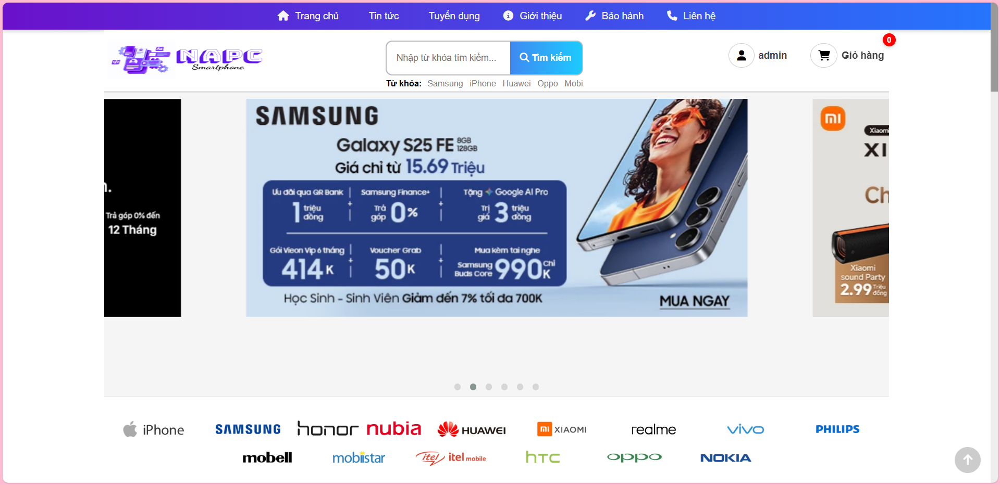
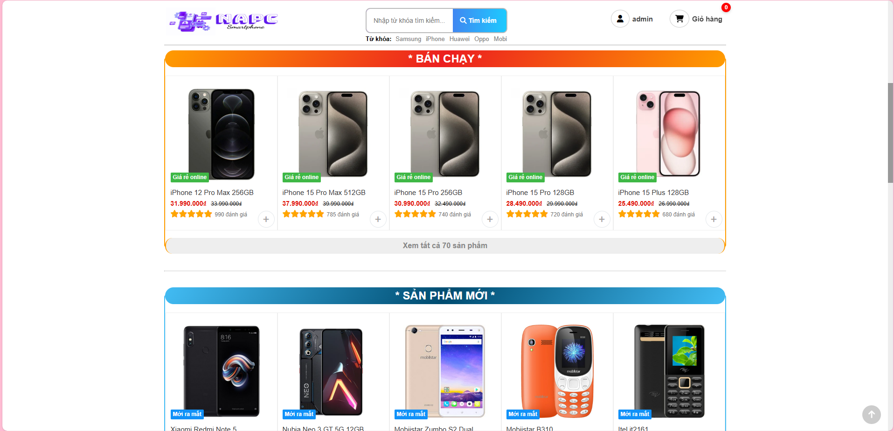
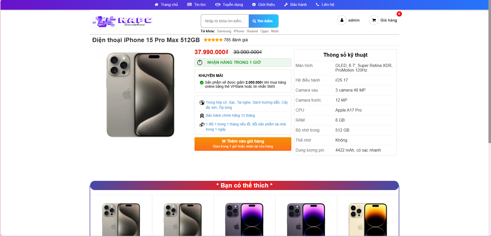
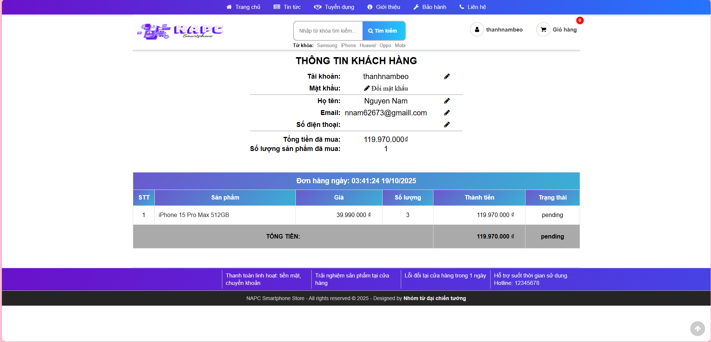
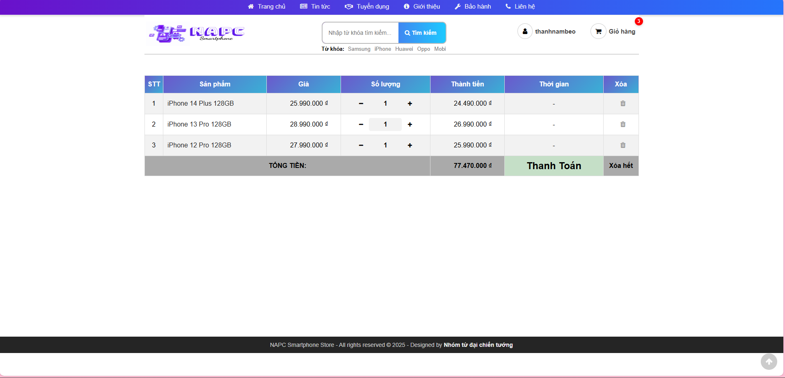
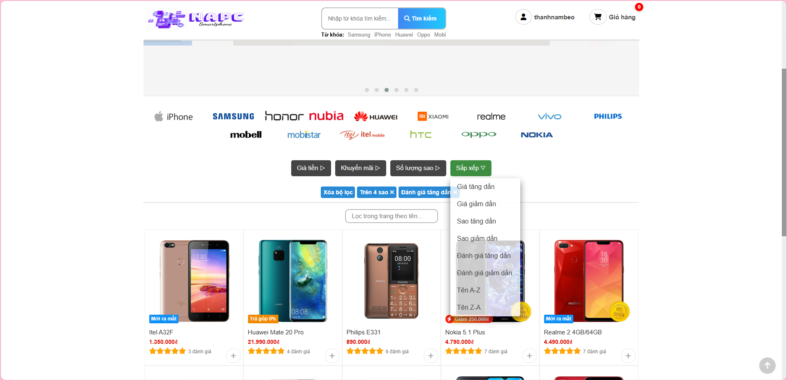
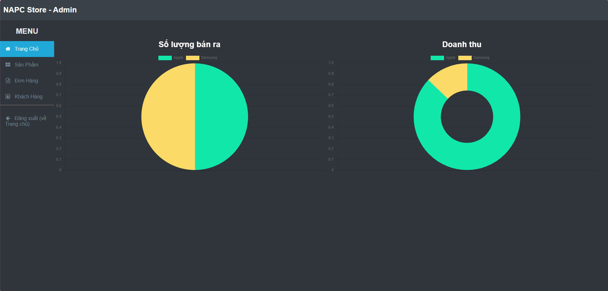
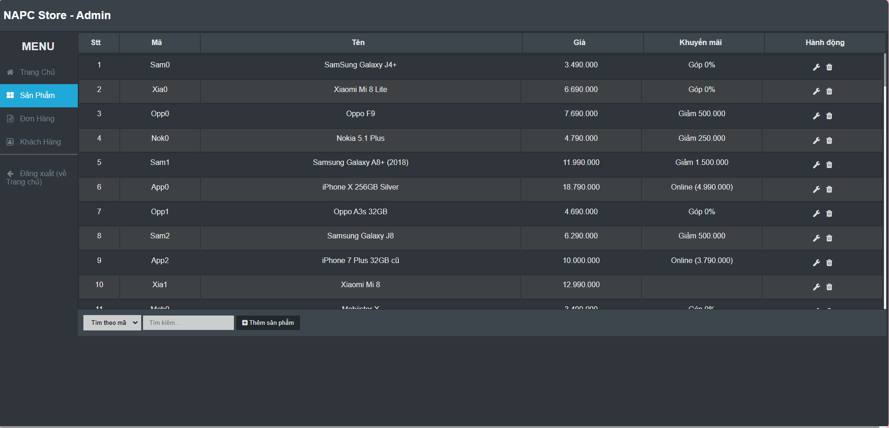
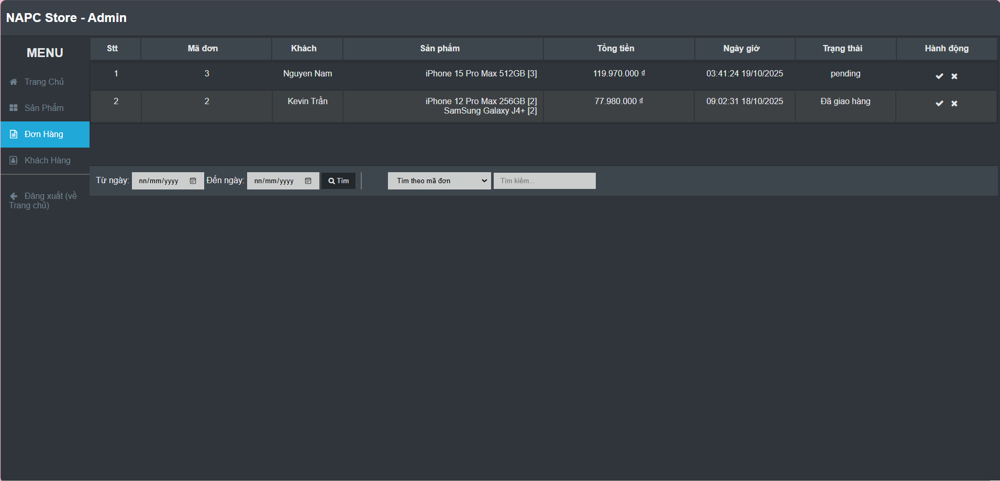
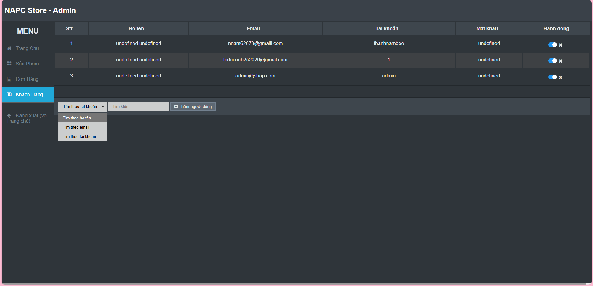

# 📱 NAPC Smartphone Store

> Đồ án môn **Phân tích thiết kế hệ thống thông tin** - Trang web bán điện thoại với kiến trúc Frontend-Backend hoàn chỉnh.

## 👥 Contributors

**Nhóm Chim sẻ đi nắng**

- Trần Đức Anh - 3122480001
- Phạm Kim Chung - 3122480006
- Nguyễn Thành Nam - 3122480034
- Bùi Tấn Phát - 3122480042

## 🚀 Tổng quan

Hệ thống e-commerce bán điện thoại với giao diện thân thiện, chức năng đầy đủ và kiến trúc hiện đại:

- **Frontend**: HTML5, CSS3, JavaScript (Vanilla)
- **Backend**: Node.js + Express.js
- **Database**: SQLite3
- **Authentication**: JWT tokens
- **API**: RESTful APIs

## ⚡ Cài đặt và Chạy

### 1. Yêu cầu hệ thống

```bash
- Node.js >= 14.0.0
- npm >= 6.0.0
```

### 2. Cài đặt Backend

```bash
cd backend        # Vào thư mục backend
npm install       # Cài đặt dependencies
npm start         # Chạy server
```

### 3. Chạy Frontend

```bash
# Mở file index.html bằng Live Server (VS Code)
# Hoặc mở trực tiếp file index.html bằng browser
```

### 4. Truy cập ứng dụng

- **Frontend**: http://localhost:5500 (Live Server)
- **Backend API**: http://localhost:3000
- **Admin Panel**: http://localhost:5500/admin.html

## 🏗️ Kiến trúc hệ thống

### Frontend Structure

```
├── index.html              # Trang chủ
├── admin.html              # Trang quản trị
├── giohang.html           # Giỏ hàng
├── nguoidung.html         # Trang người dùng
├── chitietsanpham.html    # Chi tiết sản phẩm
├── gioithieu.html         # Trang giới thiệu
├── lienhe.html            # Trang liên hệ
├── tintuc.html            # Trang tin tức
├── trungtambaohanh.html   # Trang bảo hành
├── tuyendung.html         # Trang tuyển dụng
├── css/                   # Stylesheets
├── js/                    # JavaScript modules
│   ├── api.js            # API client
│   ├── admin.js          # Admin functions
│   ├── admin-extensions.js # Admin utilities
│   ├── dungchung.js      # Common utilities
│   ├── trangchu.js       # Homepage logic
│   ├── giohang.js        # Cart functionality
│   ├── nguoidung.js      # User profile
│   ├── chitietsanpham.js # Product details
│   ├── classes.js        # Object classes
│   └── lienhe.js         # Contact page
├── img/                   # Images & assets
└── data/
    └── products.js        # Product data
```

### Backend Structure

```
backend/
├── server.js              # Main server file
├── database.js            # Database connection & initialization
├── middleware.js          # Auth middleware
├── auth.js               # Authentication routes
├── orders.js             # Order management
├── admin.js              # Admin routes
├── inventory.js          # Stock management
├── invoice.js            # PDF invoice generation
├── package.json          # Dependencies
└── database.db           # SQLite database
```

## 🔧 Chức năng chính

### 👤 User Features

- **Đăng ký/Đăng nhập** với JWT authentication
- **Trang chủ** với sản phẩm phân loại (nổi bật, mới, khuyến mãi)
- **Tìm kiếm/Lọc** sản phẩm theo hãng, giá, đánh giá
- **Chi tiết sản phẩm** với gợi ý sản phẩm tương tự
- **Giỏ hàng** với CRUD operations
- **Thanh toán** và tạo đơn hàng
- **Trang cá nhân** với lịch sử mua hàng
- **Cập nhật thông tin** cá nhân

### 🛠️ Admin Features

- **Dashboard** với thống kê doanh thu (Chart.js)
- **Quản lý sản phẩm** (CRUD) với upload ảnh
- **Quản lý đơn hàng** với cập nhật trạng thái
- **Quản lý khách hàng** với khóa/mở tài khoản
- **Báo cáo** doanh thu theo hãng

## 🔌 API Endpoints

### Authentication

```
POST /api/auth/register     # Đăng ký
POST /api/auth/login        # Đăng nhập
GET  /api/auth/profile/:id  # Lấy thông tin user
PUT  /api/auth/profile/:id  # Cập nhật thông tin
```

### Products

```
GET  /api/products          # Lấy tất cả sản phẩm
GET  /api/products/:masp    # Lấy sản phẩm theo mã SP
POST /api/admin/products    # Thêm sản phẩm (Admin)
PUT  /api/admin/products/:masp # Sửa sản phẩm (Admin)
DELETE /api/admin/products/:masp # Xóa sản phẩm (Admin)
```

### Cart & Orders

```
GET  /api/cart/:userId      # Lấy giỏ hàng
POST /api/cart/:userId      # Thêm vào giỏ
PUT  /api/cart/:userId/:masp # Cập nhật giỏ hàng
DELETE /api/cart/:userId/:masp # Xóa khỏi giỏ
DELETE /api/cart/:userId    # Xóa toàn bộ giỏ
POST /api/orders            # Tạo đơn hàng
GET  /api/orders/user/:id   # Lịch sử đơn hàng
```

### Admin

```
GET  /api/admin/stats       # Thống kê doanh thu
GET  /api/admin/orders      # Tất cả đơn hàng
GET  /api/admin/users       # Tất cả khách hàng
PUT  /api/admin/orders/:id/status # Cập nhật trạng thái
DELETE /api/admin/users/:id # Xóa khách hàng
```

### Inventory

```
GET  /api/inventory         # Lấy thông tin tồn kho
PUT  /api/inventory/products/:masp/stock # Cập nhật stock
POST /api/inventory/orders/:id/approve # Duyệt đơn (giảm stock)
POST /api/inventory/orders/:id/cancel # Hủy đơn (tăng stock)
```

## 💾 Database Schema

### Users Table

```sql
CREATE TABLE users (
    id INTEGER PRIMARY KEY AUTOINCREMENT,
    username TEXT UNIQUE NOT NULL,
    email TEXT UNIQUE NOT NULL,
    password TEXT NOT NULL,
    fullname TEXT,
    phone TEXT,
    address TEXT,
    role TEXT DEFAULT 'user',
    created_at DATETIME DEFAULT CURRENT_TIMESTAMP
);
```

### Orders & Order Items

```sql
CREATE TABLE orders (
    id INTEGER PRIMARY KEY AUTOINCREMENT,
    user_id INTEGER NOT NULL,
    total_amount REAL NOT NULL,
    status TEXT DEFAULT 'pending',
    created_at DATETIME DEFAULT CURRENT_TIMESTAMP,
    FOREIGN KEY (user_id) REFERENCES users (id)
);

CREATE TABLE order_items (
    id INTEGER PRIMARY KEY AUTOINCREMENT,
    order_id INTEGER NOT NULL,
    masp TEXT NOT NULL,
    quantity INTEGER NOT NULL,
    price REAL NOT NULL,
    FOREIGN KEY (order_id) REFERENCES orders (id)
);
```

### Inventory Table

```sql
CREATE TABLE inventory (
    masp TEXT PRIMARY KEY,
    stock INTEGER DEFAULT 25
);
```

## 🔐 Authentication Flow

1. **Đăng ký**: `POST /api/auth/register` → Tạo user mới
2. **Đăng nhập**: `POST /api/auth/login` → Trả về JWT token
3. **Lưu token**: Frontend lưu vào localStorage
4. **Gửi requests**: Attach token vào Authorization header
5. **Middleware**: Backend verify token cho protected routes

## 🛡️ Security Features

- **JWT Authentication** cho session management (không expiration)
- **Password storage** - Plain text (chưa implement bcrypt)
- **Prepared statements** - Ngăn SQL injection
- **CORS** configuration
- **Error handling** middleware với response standardization
- **Body parsing** với size limits

## 📊 Tech Stack

### Frontend

- **HTML5** - Semantic markup
- **CSS3** - Responsive design, Flexbox, Grid
- **JavaScript ES6+** - Async/await, Modules, Classes
- **Chart.js** - Data visualization
- **Font Awesome** - Icons
- **Owl Carousel** - Image sliders

### Backend

- **Node.js** - Runtime environment
- **Express.js** - Web framework
- **SQLite3** - Database
- **jsonwebtoken** - JWT authentication
- **cors** - Cross-origin requests

## 🔧 Development

### Code Structure

- **Modular JavaScript** - Tách biệt concerns
- **API-first approach** - Frontend hoàn toàn dựa vào API
- **RESTful design** - Consistent API endpoints
- **Error handling** - Comprehensive error management
- **Responsive design** - Mobile-friendly UI

### Best Practices

- **Separation of concerns** - Frontend/Backend tách biệt
- **API consistency** - Chuẩn RESTful
- **Error handling** - User-friendly messages
- **Security first** - Authentication & validation
- **Performance** - Optimized queries & caching

## 🎯 Admin Account

**Username**: `admin`  
**Password**: `adadad`

## 🚦 Dự án

#### 🛒 **A.1: Người mua hàng**

- **Xem thông tin hàng hóa** - Trang chủ, chi tiết sản phẩm
- **Tìm kiếm sản phẩm** - Real-time search
- **Lọc theo giá/tên** - Filter hãng, giá, sắp xếp
- **Chức năng mua hàng** - Giỏ hàng, thanh toán

#### 👨💼 **A.2: Nhân viên bán hàng (Admin)**

- **Duyệt đơn hàng** - Cập nhật trạng thái, giảm stock
- **Hủy đơn hàng** - Hoàn trả stock nếu đã duyệt
- **In hóa đơn** - PDF invoice tự động
- **Xem hóa đơn theo thời gian** - Date picker với validation
- **Thống kê báo cáo** - Charts doanh thu theo hãng
- **Quản lý sản phẩm** - CRUD hoàn chỉnh

#### 🏪 **Quản lý kho hàng**

- **Stock tự động** - Giảm khi duyệt, tăng khi hủy đơn
- **Validation** - Kiểm tra đủ hàng trước khi duyệt
- **Cập nhật real-time** - Admin có thể điều chỉnh stock

### 🔧 **Tính năng kỹ thuật**

- **Frontend-Backend Integration** - API-driven architecture
- **Authentication System** - JWT tokens
- **Database** - SQLite với inventory management
- **Admin Dashboard** - Statistics với Chart.js
- **Shopping Cart** - Full CRUD operations
- **Order Management** - Complete workflow
- **Date Picker** - Filter đơn hàng theo thời gian
- **Search & Filter** - Real-time với validation
- **Responsive Design** - Mobile-friendly
- **Error Handling** - User-friendly messages
- **Security** - Input validation & protection

## 📝 Changelog

### v3.0.0 (Latest - Production Ready)

- Quản lý kho hàng tự động (stock management)
- Date picker với validation đầy đủ
- Search & Filter real-time cho tất cả modules
- PDF invoice generation
- Thống kê doanh thu theo hãng
- Error handling và user feedback
- Console logging cho debugging

### v2.0.0

- Hoàn thành tích hợp Frontend-Backend
- JWT authentication
- API-driven architecture
- Admin dashboard với Chart.js

### v1.0.0

- Static website với localStorage
- Basic CRUD operations

---

## 📸 Screenshots

### 🛍️ User Interface

| Feature                | Screenshot                                     |
| ---------------------- | ---------------------------------------------- |
| **Trang chủ**          |   |
| **Danh sách sản phẩm** |    |
| **Chi tiết sản phẩm**  |    |
| **Đăng nhập**          |    |
| **Đăng ký**            |      |
| **Trang cá nhân**      |  |
| **Giỏ hàng**           |    |
| **Tìm kiếm & Lọc**     |    |

### 🛠️ Admin Dashboard

| Feature                | Screenshot                                      |
| ---------------------- | ----------------------------------------------- |
| **Thống kê doanh thu** |     |
| **Quản lý sản phẩm**   |    |
| **Quản lý đơn hàng**   |    |
| **Quản lý khách hàng** |  |hành tích hợp Frontend-Backend
- JWT authentication
- API-driven architecture
- Admin dashboard với Chart.js

### v1.0.0

- Static website với localStorage
- Basic CRUD operations

---

## 📸 Screenshots

### 🛍️ User Interface

| Feature                | Screenshot                                     |
| ---------------------- | ---------------------------------------------- |
| **Trang chủ**          |   |
| **Danh sách sản phẩm** |    |
| **Chi tiết sản phẩm**  |    |
| **Đăng nhập**          |    |
| **Đăng ký**            |      |
| **Trang cá nhân**      |  |
| **Giỏ hàng**           |    |
| **Tìm kiếm & Lọc**     |    |

### 🛠️ Admin Dashboard

| Feature                | Screenshot                                      |
| ---------------------- | ----------------------------------------------- |
| **Thống kê doanh thu** |     |
| **Quản lý sản phẩm**   |    |
| **Quản lý đơn hàng**   |    |
| **Quản lý khách hàng** |  |
